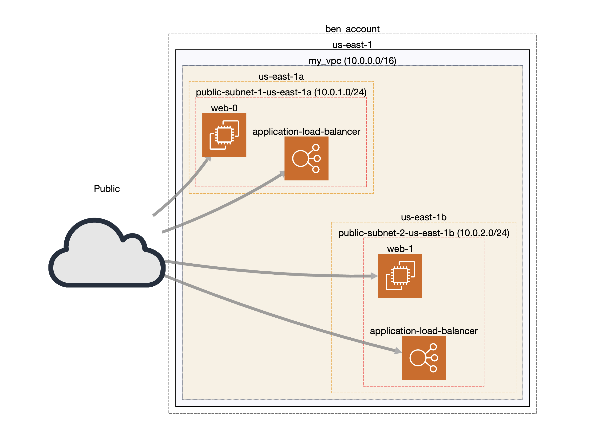

# AWS VPC using Terraform and Github Actions

This projects demonstrates creating a VPC network in AWS using terrafor for IaC and Github Actions for CI/CD.

Following a map generated by the [CloudMapper](https://github.com/duo-labs/cloudmapper) tool:

Note:
1. Opening a pull request scans the terraform code for any possible vulnerabilities and reports them in the [`Security > Code scanning`](https://github.com/bensooraj/aws-vpc-terraform-ga/security/code-scanning?query=pr%3A1) section.

2. Pushing to the main branch will deploy the code to AWS.
